# 🚀 ADP AssetHub

> Enterprise Asset Management & Lifecycle Tracking Platform

ADP AssetHub is an enterprise-style asset management platform for tracking company IT assets — laptops, phones, and other equipment — through their entire lifecycle. It manages employees, assignments, returns, repairs, reimbursements, and keeps a full audit trail of everything that happens along the way.

<p>
  
  
  
  
  
  
  
  
  
</p>

<!--
LIVE WEBSITE:
[PASTE ACTUAL VERCEL LIVE URL HERE]
-->

🌐 **Live Demo:** _link coming soon_
💻 **GitHub:** this repository
🎥 **Product Demo:** _video coming soon_

---

## 📊 Quick Overview

| | |
|---|---|
| 🎯 Purpose | Enterprise IT asset management |
| 👥 Users | Super Admin, Admin, Employee |
| 🧠 Architecture | Next.js + Prisma + PostgreSQL |
| 🔐 Authentication | Auth.js — Credentials + Google OAuth |
| 🗄️ Database | PostgreSQL on Neon |
| 🚀 Deployment | Vercel |
| 🎨 UI | Responsive glassmorphism design, dark/light themes |

---

## 📸 Product Preview

<!--
Real screenshot, once available:
docs/screenshots/admin-dashboard.png
-->

🖼️ **Screenshot placeholder** — final preview: `docs/screenshots/admin-dashboard.png`

---

## 🚀 What is ADP AssetHub?

ADP AssetHub lets an organization manage physical IT assets and their relationship with employees throughout the asset's lifecycle.

Without a centralized system, an organization can struggle to know:

- what assets it owns
- where an asset currently is
- who currently has an asset
- whether it's available
- whether it's being repaired
- whether someone has requested its return
- what happened to the asset previously

ADP AssetHub centralizes all of this: every asset has a single record, a defined status, and a full history — assignments, returns, repairs, and reimbursements — that admins and employees can see according to their role.

---

## ✨ Key Features

### 📦 Asset Management
- Asset inventory with search and filtering
- Detailed asset records (specs, purchase info, warranty)
- Asset status tracking
- Full lifecycle history per asset

### 👥 Employee Management
- Employee directory
- Employee details
- OTP-based employee onboarding
- Employee-scoped asset visibility

### 🔄 Assignment & Custody
- Asset assignment to employees
- Full custody/assignment history
- Return workflows

### 📨 Requests
- Asset requests (employee → admin)
- Return requests (employee → admin)
- Approval / rejection workflows

### 🔧 Repairs & Maintenance
- Maintenance records per asset
- Repair status tracking
- Repair history
- Asset recovery back to available

### 💰 Reimbursements
- Repair reimbursement requests
- Approval / rejection workflow
- Optional link to the originating maintenance record

### 🛡️ Security & Administration
- Authentication (Credentials + Google OAuth)
- Server-side, role-based authorization
- Super Admin admin-account management
- Append-only audit logs

### 🔔 Platform Features
- In-app notifications
- Profile & settings
- Dark / light theme
- Responsive UI
- Public demo mode

---

## 👥 Who Uses ADP AssetHub?

### 👑 Super Admin
Controls the administrative side of the platform and manages administrator accounts.

### 🛡️ Admin
Manages:
- assets
- employees
- assignments
- asset requests & return requests
- repairs
- reimbursements
- audit activity

### 👤 Employee
Can:
- view assigned assets
- view available assets
- request assets
- request returns
- manage their own profile and permitted settings

---

## 🔐 Role Access Flow

<!--
DIAGRAM PLACEHOLDER:
Replace this section with:
docs/diagrams/role-access-flow.png
-->

🖼️ **Diagram placeholder** — final visual diagram: `docs/diagrams/role-access-flow.png`

> This diagram shows how Super Admin, Admin and Employee users enter the system and access different capabilities according to their roles.

---

## 🔄 How ADP AssetHub Works

<!--
DIAGRAM PLACEHOLDER:
Replace this section with:
docs/diagrams/asset-workflow.png
-->

🖼️ **Diagram placeholder** — final visual diagram: `docs/diagrams/asset-workflow.png`

The core flow, in simple terms:

```
👤 Employee needs asset
↓
📦 Asset is available
↓
🛡️ Admin assigns asset
↓
💻 Employee uses asset
↓
↩️ Employee requests return
↓
🔍 Admin reviews request
↓
🟢 Asset becomes available
```

Or, when something goes wrong:

```
🔧 Asset goes to repair
↓
🟢 Repair completed
↓
📦 Asset becomes available
```

---

## 🔐 Authentication & Access

<!--
DIAGRAM PLACEHOLDER:
Replace this section with:
docs/diagrams/authentication-flow.png
-->

🖼️ **Diagram placeholder** — final visual diagram: `docs/diagrams/authentication-flow.png`

```
👤 User
↓
🔐 Login
↓
✅ Authentication
↓
🛡️ Role Check
↓
👑 Super Admin   🛡️ Admin   👤 Employee
```

> The application first verifies who the user is, then determines which parts of the system that user is allowed to access.

---

## 🔄 Asset Lifecycle

<!--
DIAGRAM PLACEHOLDER:
Replace this section with:
docs/diagrams/asset-lifecycle.png
-->

🖼️ **Diagram placeholder** — final visual diagram: `docs/diagrams/asset-lifecycle.png`

The asset state machine has five states:

**Available**
Asset is ready to be assigned.

**Assigned**
Asset is currently with an employee.

**Return Requested**
Employee has requested the asset be returned.

**In Repair**
Asset is undergoing maintenance.

**Retired**
Asset is no longer available for normal assignment.

---

## 🧩 Core Workflows

### 📦 Asset Assignment
1. Admin selects an available asset.
2. Admin selects an employee.
3. An assignment record is created.
4. The asset's status updates accordingly.
5. History/audit information is recorded.

### ↩️ Return Request
1. Employee requests a return.
2. Admin reviews the request.
3. Admin approves or rejects it.
4. The assignment/asset status updates according to the outcome.
5. History/audit is maintained.

### 🔧 Repair
1. An asset enters the repair workflow.
2. A maintenance record is created.
3. Repair progress is tracked.
4. The asset becomes available again once repair is completed.

### 📨 Asset Request
1. Employee requests an asset.
2. Admin reviews it.
3. Admin approves or rejects it.
4. An approved request creates an assignment.

### 💰 Reimbursement
An employee can submit a reimbursement request for an out-of-pocket repair expense, optionally linked to the maintenance record it relates to. An admin then approves or rejects the request. This tracks the claim only — it does not process any payment.

---

## 🧠 System Architecture

<!--
DIAGRAM PLACEHOLDER:
Replace this section with:
docs/diagrams/system-architecture.png
-->

🖼️ **Diagram placeholder** — final visual diagram: `docs/diagrams/system-architecture.png`

Conceptually:

```
User
↓
Next.js Application
↓
Authentication / Authorization
↓
Server-side business logic (Server Actions)
↓
Prisma
↓
Neon PostgreSQL
```

External integrations used alongside this core flow:
- **Google OAuth** — sign-in
- **Resend** — OTP delivery for employee onboarding

---

## 🗂️ Project Structure

```text
src/
├── app/                  # Next.js App Router routes (dashboard, auth, onboarding, demo)
├── components/           # UI components, organized by feature + shared design system
├── lib/
│   ├── actions/          # Server actions (mutations) — one file per domain
│   ├── data/             # Server-side data-fetching functions (reads)
│   ├── validations/      # Zod schemas per domain
│   ├── auth-guards.ts    # requireAuth / requireRole — real authorization boundary
│   └── demo.ts           # Demo-mode isolation guards
├── config/               # Route-access configuration
└── proxy.ts              # Edge-level coarse route gate
prisma/
├── schema.prisma         # Database schema
└── seed.ts               # Seed data
```

- **`lib/data/`** vs **`lib/actions/`** — a deliberate split between read-only data fetching and server-action mutations.
- **`auth-guards.ts`** — the real, server-side authorization boundary used by every protected page and action.
- **`proxy.ts`** — an edge-level route gate; defense-in-depth, not the sole authorization check.

---

## 🗃️ Database Design

PostgreSQL, hosted on **Neon**, accessed through **Prisma**.

Core models:

- `User` — login identity
- `Employee` — company directory record (decoupled from `User`)
- `Asset` — the trackable inventory item
- `AssetAssignment` — custody history
- `ReturnRequest` — employee-initiated return requests
- `AssetRequest` — employee-initiated asset requests
- `MaintenanceRecord` — repair/service history
- `Reimbursement` — repair expense claims
- `AssetLocation` — asset's physical location
- `AuditLog` — append-only action log
- `Notification` — in-app notifications

<!--
DIAGRAM PLACEHOLDER:
Replace this section with:
docs/diagrams/database-er-diagram.png
-->

🖼️ **Diagram placeholder** — final visual diagram: `docs/diagrams/database-er-diagram.png`

**Key relationships:**
- A `User` optionally links to one `Employee` — directory records can exist before an employee ever signs in.
- An `Asset` has many `AssetAssignment`, `ReturnRequest`, `AssetRequest`, `MaintenanceRecord`, and `Reimbursement` records, plus at most one `AssetLocation`.
- A `Reimbursement` optionally links to the `MaintenanceRecord` it relates to.
- `AuditLog` and `Notification` both reference the acting/receiving `User`.

---

## 🔐 Security & Authorization

> 🔐 **Authentication** identifies the user.
> 🛡️ **Authorization** decides what that user can access.

- **Authentication** via Auth.js v5 — Credentials (bcrypt-hashed passwords) and Google OAuth, using JWT sessions.
- **Password hashing** with bcrypt.
- **OTP-based onboarding** — new employee accounts activate via an emailed, hashed one-time code before gaining dashboard access.
- **Authorization** is enforced server-side and hierarchically (`SUPER_ADMIN > ADMIN > EMPLOYEE`) via `requireAuth` / `requireRole` — the edge-level route gate is a coarse first layer only, never the sole check.
- **Protected routes** — every page and server action re-validates role and, where relevant, ownership (e.g. an employee viewing an asset's detail page).
- **Validation** — all mutations are validated with Zod before touching the database.
- **Audit logs** — significant actions are recorded in an append-only log.
- **Demo-mode protections** — demo accounts are scoped to isolated, clearly-tagged demo data; server-side guards prevent a demo session from mutating real records.

---

## 🎥 Product Demo

<!--
Video URL not yet provided.
-->

🎬 **Watch Full Product Demo** — _link coming soon_

The full demo will walk through authentication, the dashboard, assets, employees, assignments, asset requests, return requests, repairs, reimbursements, audit logs, and the employee experience.

---

## 🖥️ Screenshots

> Screenshots below reference expected paths under `docs/screenshots/`. They will render once the corresponding files are added.

### 🔐 Authentication

<table>
<tr>
<td align="center" width="50%">
<sub><b>🔑 Login</b></sub><br>
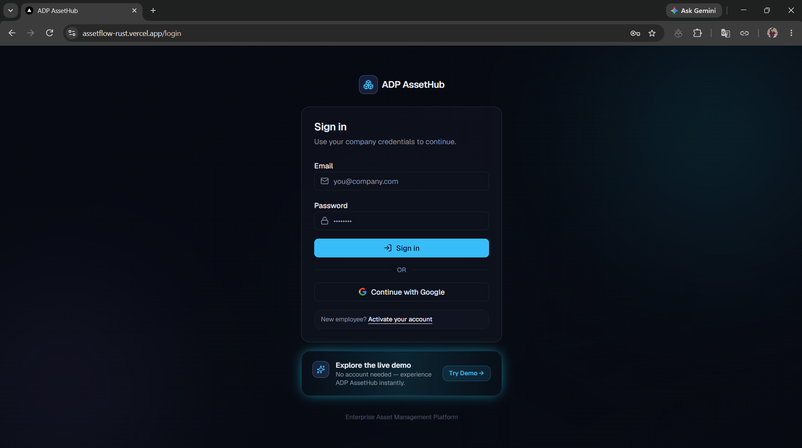
</td>
</tr>
</table>

### 📊 Admin Experience

<table>

<td align="center" width="50%">
<sub><b>📊 Admin Dashboard</b></sub><br>
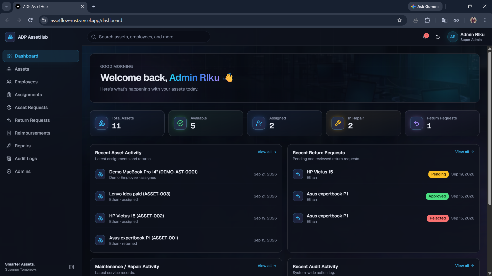
</td>

<tr>
<td align="center" width="50%">
<sub><b>📦 Assets</b></sub><br>
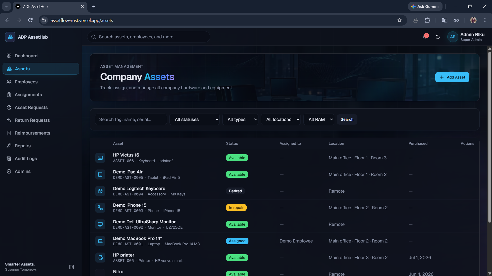
</td>
<td align="center" width="50%">
<sub><b>📄 Asset Details</b></sub><br>
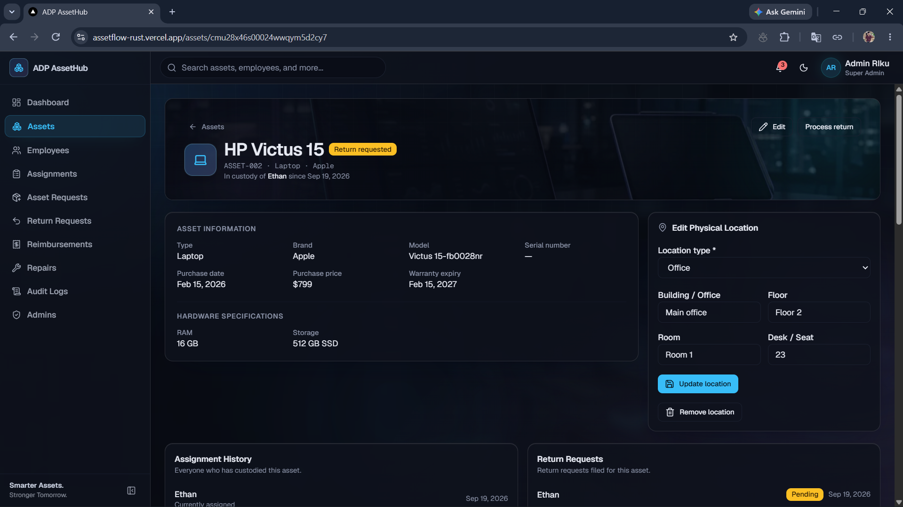
</td>
</tr>
<tr>
<td align="center" width="50%">
<sub><b>👥 Employees</b></sub><br>
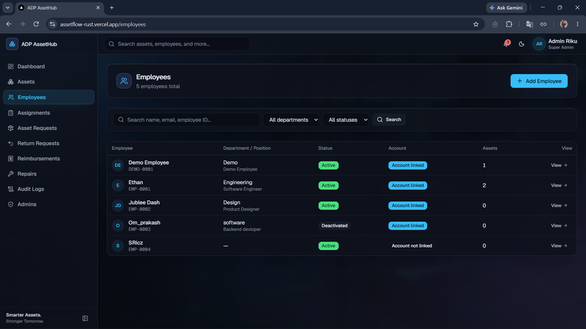
</td>
<td align="center" width="50%">
<sub><b>🔄 Assignments</b></sub><br>
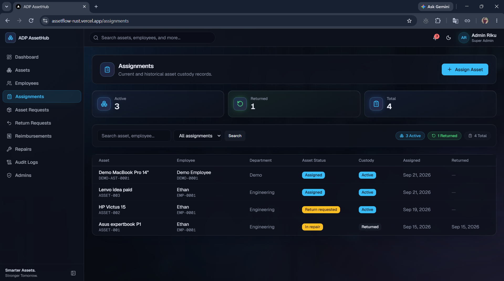
</td>
</tr>
</table>

### 🔄 Business Workflows

<table>
<tr>
<td align="center" width="50%">
<sub><b>📨 Asset Requests</b></sub><br>
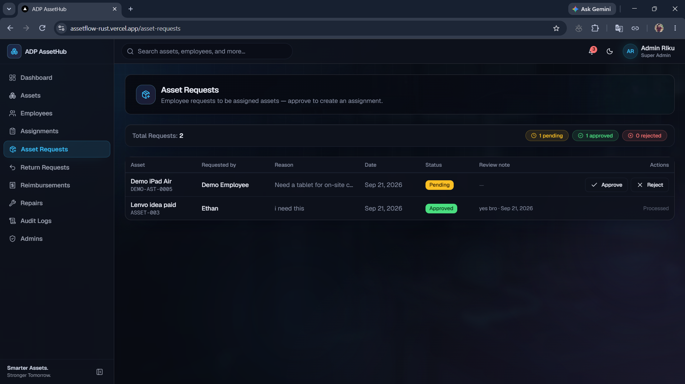
</td>
<td align="center" width="50%">
<sub><b>↩️ Return Requests</b></sub><br>
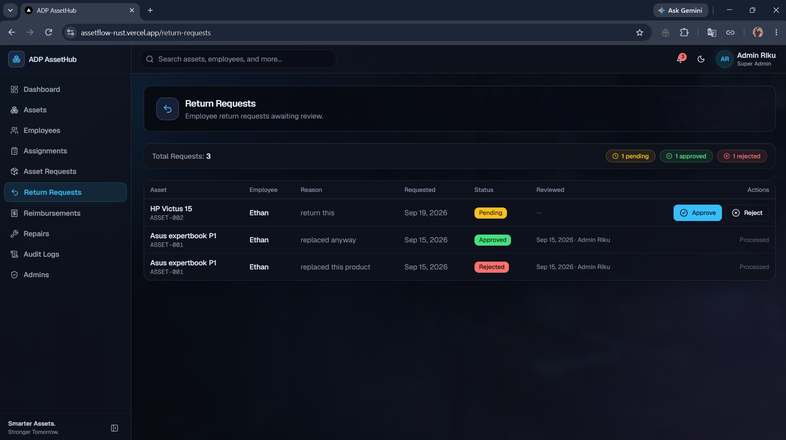
</td>
</tr>
<tr>
<td align="center" width="50%">
<sub><b>🔧 Repairs</b></sub><br>
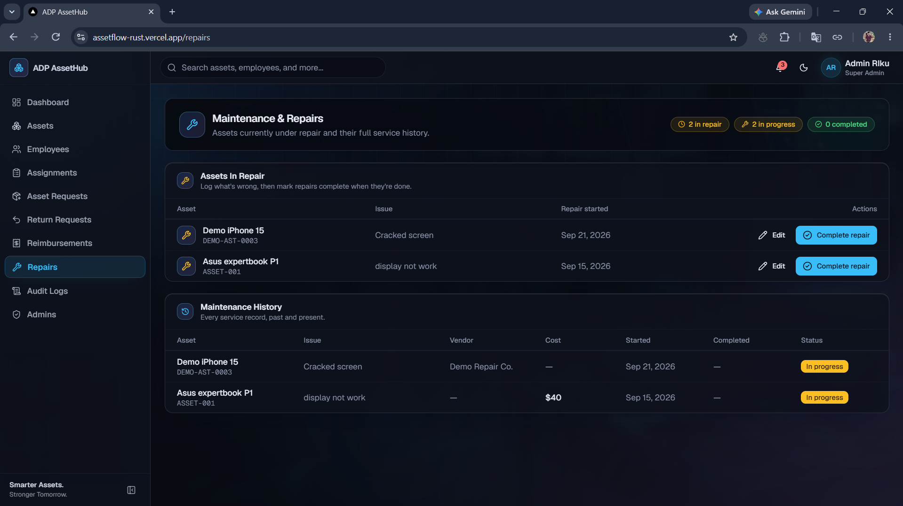
</td>
<td align="center" width="50%">
<sub><b>💰 Reimbursements</b></sub><br>
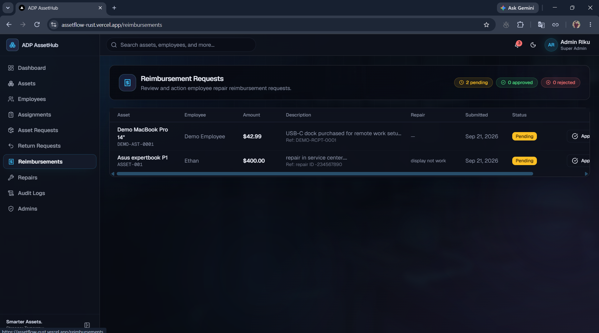
</td>
</tr>
</table>

### 🛡️ Administration & Security

<table>
<tr>
<td align="center" width="50%">
<sub><b>📜 Audit Logs</b></sub><br>
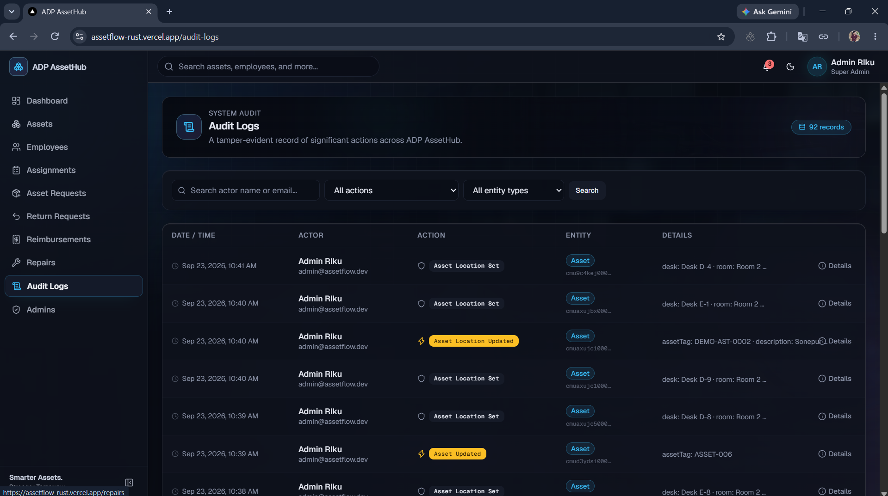
</td>
<td align="center" width="50%">
<sub><b>👑 Admins</b></sub><br>
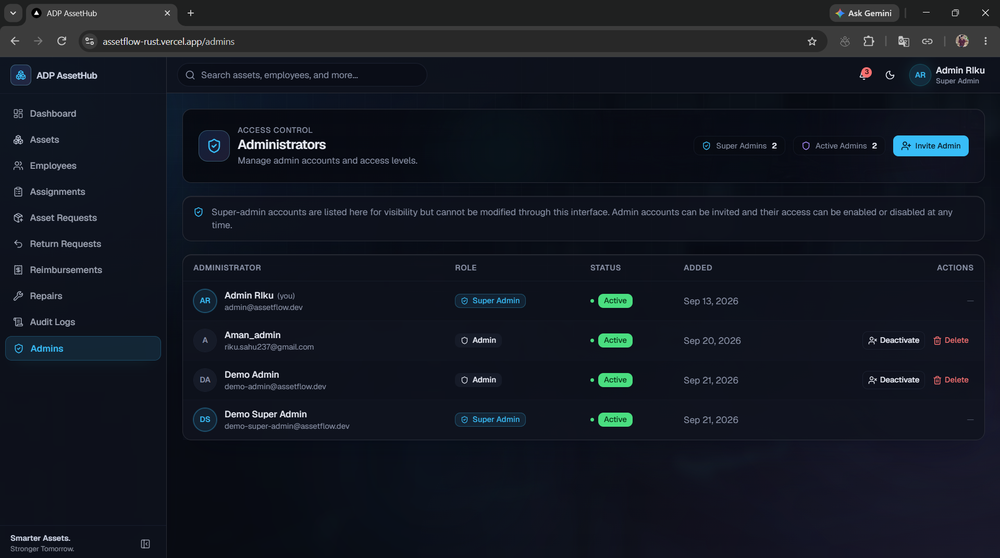
</td>
</tr>
</table>

### 👤 Employee Experience

<table>
<tr>
<td align="center" width="50%">
<sub><b>🏠 Employee Dashboard</b></sub><br>
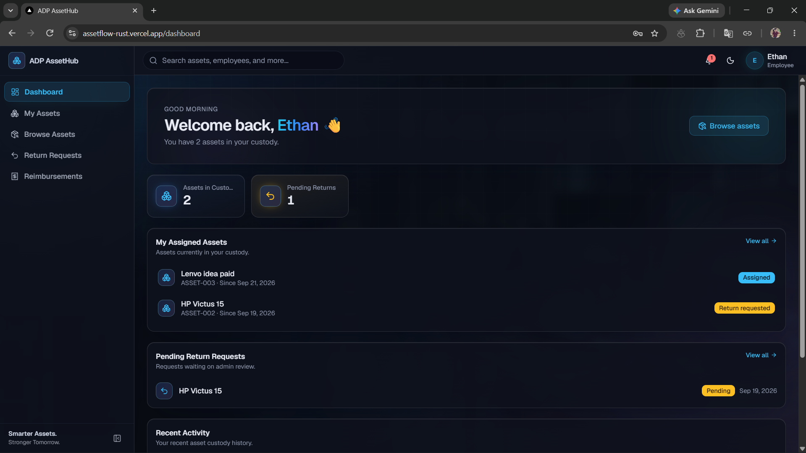
</td>
<td align="center" width="50%">
<sub><b>💻 My Assets</b></sub><br>
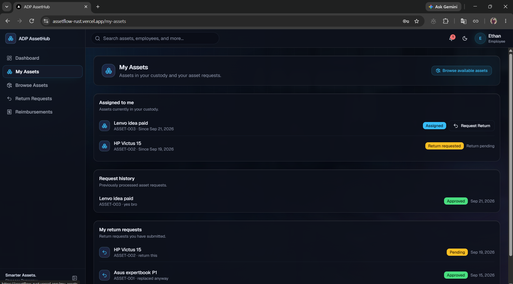
</td>
</tr>
<tr>
<td align="center" width="50%">
<sub><b>👤 Profile</b></sub><br>
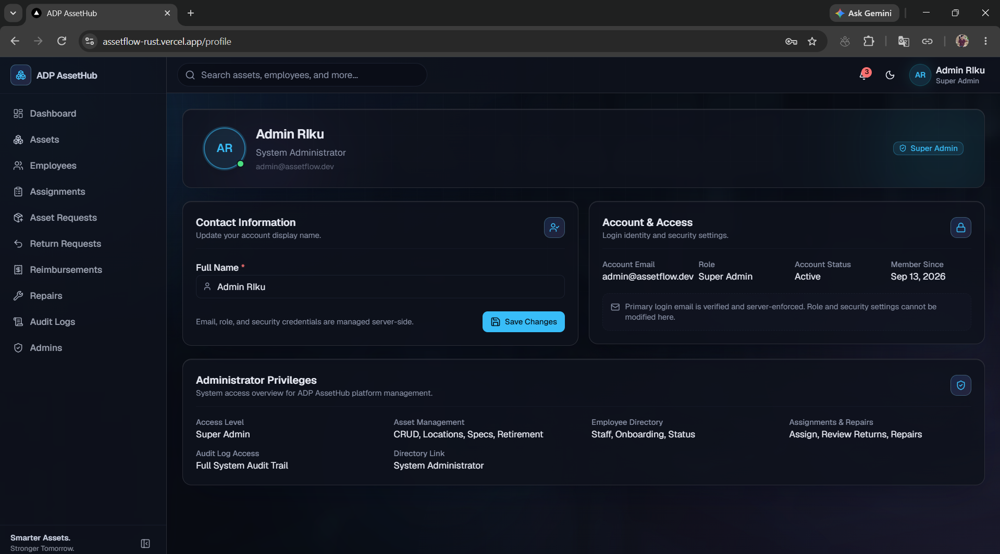
</td>
<td align="center" width="50%">
<sub><b>⚙️ Settings</b></sub><br>
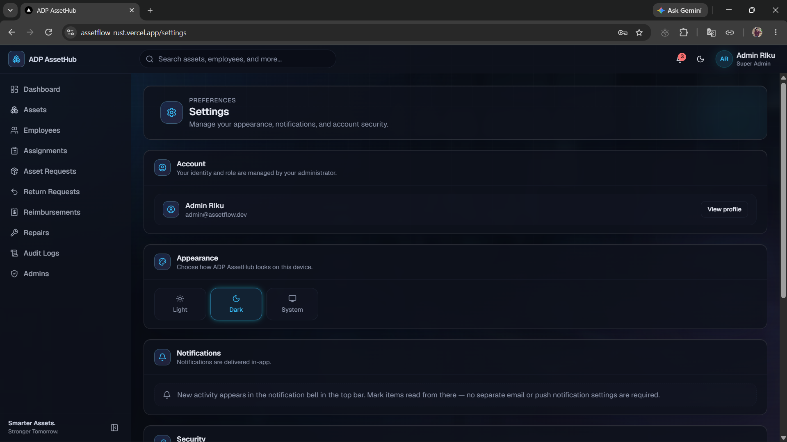
</td>
</tr>
</table>

---

## ⚙️ Tech Stack

| Layer | Technology |
|---|---|
| Frontend | Next.js 16 (App Router) |
| UI | React 19 + Tailwind CSS 4 |
| Language | TypeScript |
| Database | PostgreSQL |
| ORM | Prisma 7 |
| Authentication | Auth.js v5 |
| OAuth | Google |
| Validation | Zod |
| Email | Resend |
| Deployment | Vercel |
| Database Hosting | Neon |

---

## 🚀 Deployment

<!--
DIAGRAM PLACEHOLDER:
Replace this section with:
docs/diagrams/deployment-architecture.png
-->

🖼️ **Diagram placeholder** — final visual diagram: `docs/diagrams/deployment-architecture.png`

```
GitHub
↓
Vercel
↓
Neon PostgreSQL
```

The application deploys from this repository to **Vercel**, connecting to a **Neon**-hosted PostgreSQL database. External integrations used in production include **Google OAuth** (sign-in) and **Resend** (OTP email delivery).

---

## 🛠️ Local Development

```bash
# 1. Clone the repository
git clone <this-repo-url>
cd assetflow

# 2. Install dependencies (also runs `prisma generate`)
npm install

# 3. Configure environment variables
cp .env.example .env
# fill in the values — see Environment Variables below

# 4. Run database migrations
npx prisma migrate dev

# 5. (Optional) Seed the database
npx tsx prisma/seed.ts

# 6. Start the development server
npm run dev
```

Open [http://localhost:3000](http://localhost:3000).

Other scripts (from `package.json`):

```bash
npm run build              # production build
npm run start               # run the production build
npm run lint                 # ESLint
npm run promote:superadmin   # promote a user to SUPER_ADMIN (CLI only)
```

---

## 🔑 Environment Variables

| Variable | Purpose |
|---|---|
| `DATABASE_URL` | PostgreSQL connection string (Prisma) |
| `AUTH_SECRET` | Auth.js session secret |
| `AUTH_URL` | Application base URL, used for Auth.js callbacks |
| `AUTH_GOOGLE_ID` | Google OAuth client ID |
| `AUTH_GOOGLE_SECRET` | Google OAuth client secret |
| `RESEND_API_KEY` | Resend API key |
| `RESEND_FROM` | Sender address for OTP emails |
| `DEMO_ADMIN_PASSWORD` | Password for the seeded demo admin account |
| `DEMO_EMPLOYEE_PASSWORD` | Password for the seeded demo employee account |
| `DEMO_SUPER_ADMIN_PASSWORD` | Password for the seeded demo super admin account |

No real secret values are included here — see `.env.example` for placeholder formatting.

---

## 🎮 Demo Mode

ADP AssetHub includes a public `/demo` entry point where a visitor can try the Employee, Admin, and Super Admin experiences without an account. Demo accounts and their associated records are isolated by fixed identifiers (dedicated demo emails, employee codes, and asset tags), and server-side guards prevent a demo session from modifying any real, non-demo-tagged data — regardless of the role it's using.

This is a data-isolation safeguard for the demo experience, not a general-purpose security certification.

---

## 💡 Engineering Highlights

- 🔐 **Server-side RBAC** — role-based permissions are enforced on the server for every page and action, not just hidden in the UI.
- 🔄 **Asset State Machine** — asset lifecycle transitions follow a defined set of states.
- 📋 **Custody History** — assignments are preserved as history rather than overwritten.
- 🛡️ **Auditability** — significant actions are recorded in an append-only audit log.
- 👤 **Decoupled Employee Directory** — employee directory records can exist independently of a login account.
- 📨 **Secure Onboarding** — OTP-based account activation links a login to a directory record.
- 🎨 **Reusable UI System** — a shared glassmorphism design system keeps the interface consistent across pages.
- 📱 **Responsive Experience** — admin and employee interfaces adapt across desktop and mobile.

---

## 📈 Future Improvements

- Automated end-to-end and integration test coverage
- Bulk asset import/export
- Configurable notification preferences (currently in-app only)
- Reporting/analytics dashboards beyond the current activity feeds
- Multi-tenant support for organizations with multiple business units
