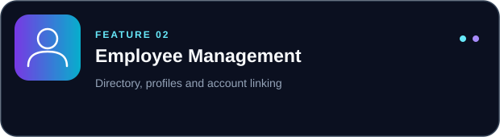
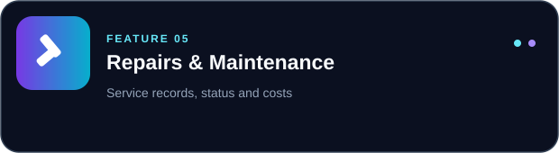
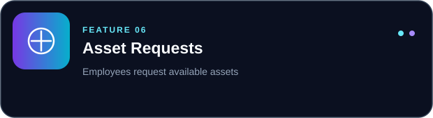
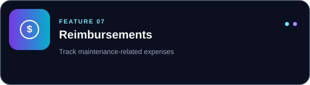
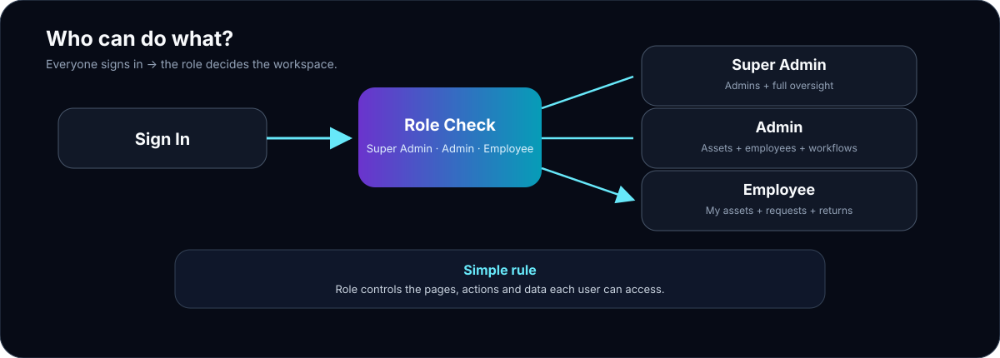
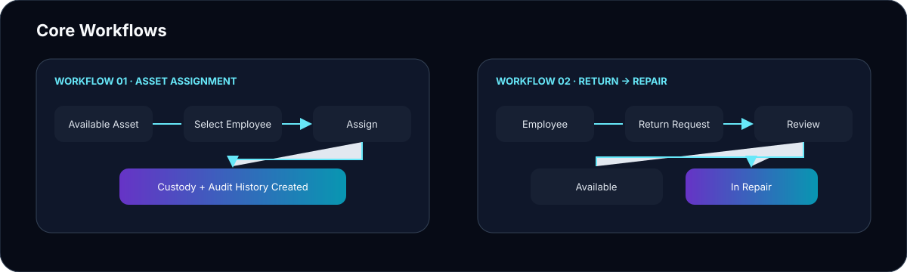
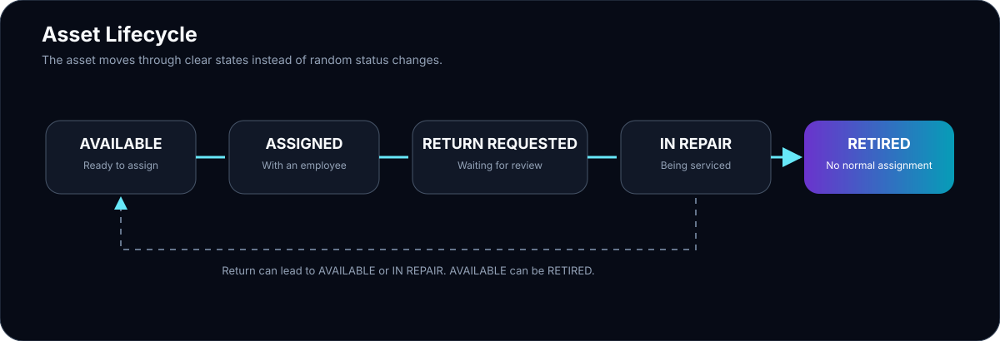
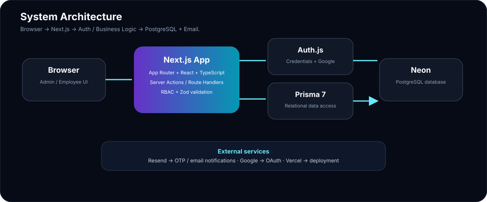
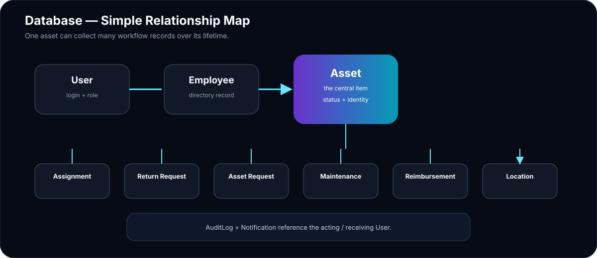

# ADP AssetHub

> Enterprise Asset Management & Lifecycle Tracking Platform

ADP AssetHub is an enterprise-style asset management platform for tracking company IT assets through their complete lifecycle — from procurement to retirement — with full employee custody tracking, repair workflows, reimbursements, and an immutable audit trail.

<p>
  
  
  
  
  
  
  
  
  
</p>

🌐 **Live Demo:** _coming soon_ &nbsp;|&nbsp; 🎥 **Product Demo:** see [§ Product Demo](#-product-demo) below

---

## 📊 At a Glance

<table>
<tr>
<td><b>🎯 Purpose</b></td><td>Enterprise IT asset management</td>
<td><b>🧠 Architecture</b></td><td>Next.js + Prisma + PostgreSQL</td>
</tr>
<tr>
<td><b>👥 Roles</b></td><td>Super Admin · Admin · Employee</td>
<td><b>🔐 Auth</b></td><td>Auth.js — Credentials + Google OAuth</td>
</tr>
<tr>
<td><b>🗄️ Database</b></td><td>PostgreSQL on Neon</td>
<td><b>🚀 Deployment</b></td><td>Vercel</td>
</tr>
</table>

---

## 📸 Product Preview


---

## ✨ Key Features

<table>
<tr>
<td width="50%"></td>
<td width="50%"></td>
</tr>
<tr>
<td width="50%"></td>
<td width="50%"></td>
</tr>
<tr>
<td width="50%"></td>
<td width="50%"></td>
</tr>
<tr>
<td width="50%"></td>
<td width="50%"></td>
</tr>
</table>

---

## 👥 Role Access



| Role | Access |
|---|---|
| **Super Admin** | Full platform access + administrator account management |
| **Admin** | Assets, employees, assignments, requests, repairs, reimbursements, audit logs |
| **Employee** | Own assets, available assets, requests, returns, profile |

> Authorization is enforced **server-side** for every page and action — role visibility in the UI is cosmetic; the real check happens on the server.

---

## 🔄 Core Workflows



<table>
<tr>
<td width="50%">

**Asset Workflow**
1. Admin assigns an available asset to an employee
2. Employee uses the asset
3. Employee requests a return
4. Admin approves → asset becomes available
5. Admin can send asset to repair → returns to available

</td>
<td width="50%">

**Employee Onboarding**
1. Admin creates employee directory record
2. System sends OTP activation email
3. Employee enters OTP to activate account
4. Account is linked to directory record
5. Employee accesses dashboard

</td>
</tr>
<tr>
<td width="50%">

**Reimbursement Flow**
1. Employee pays for a repair out-of-pocket
2. Employee submits a reimbursement request (optionally linked to maintenance record)
3. Admin reviews, approves or rejects
4. Employee is notified; audit log is updated

</td>
<td width="50%">

**Asset Request Flow**
1. Employee requests an available asset
2. Admin reviews the request
3. Admin approves → assignment is created automatically
4. Admin rejects → employee is notified

</td>
</tr>
</table>

---

## 📦 Asset Lifecycle



<table>
<tr>
<td width="50%">

**States**
| State | Meaning |
|---|---|
| `AVAILABLE` | Ready for assignment |
| `ASSIGNED` | With an employee |
| `RETURN_REQUESTED` | Return pending review |
| `IN_REPAIR` | Under maintenance |
| `RETIRED` | No longer active |

</td>
<td width="50%">

**Transitions**
- Admin assigns → `AVAILABLE` → `ASSIGNED`
- Employee requests return → `ASSIGNED` → `RETURN_REQUESTED`
- Admin approves return → `RETURN_REQUESTED` → `AVAILABLE`
- Admin sends for repair → `IN_REPAIR`
- Repair completed → `AVAILABLE`
- Admin retires → `RETIRED`

</td>
</tr>
</table>

---

## 🧠 System Architecture



```
Browser
  └── Next.js App (Vercel)
        ├── UI — React Server + Client Components
        ├── Server Actions — mutations, validated with Zod
        ├── Auth — Auth.js v5 (JWT, Credentials, Google OAuth)
        ├── Prisma ORM
        └── Neon PostgreSQL
              External: Resend (OTP email), Google OAuth
```

---

## 🗃️ Database Design



<table>
<tr>
<td width="50%">

**Core Models**
| Model | Role |
|---|---|
| `User` | Login identity |
| `Employee` | Company directory record |
| `Asset` | Trackable inventory item |
| `AssetAssignment` | Custody record |
| `ReturnRequest` | Return workflow |
| `AssetRequest` | Employee asset request |

</td>
<td width="50%">

**Supporting Models**
| Model | Role |
|---|---|
| `MaintenanceRecord` | Repair history |
| `Reimbursement` | Expense claim |
| `AssetLocation` | Physical location |
| `AuditLog` | Append-only event log |
| `Notification` | In-app alerts |
| `Account` / `Session` | Auth.js internals |

</td>
</tr>
</table>

**Key relationships:**
- `User` optionally links to one `Employee` — directory records exist before sign-in
- `Asset` accumulates `AssetAssignment`, `ReturnRequest`, `AssetRequest`, `MaintenanceRecord`, `Reimbursement`, and `AssetLocation` records over its lifetime
- `AuditLog` references the acting `User` with `onDelete: SetNull` — audit history is preserved even if an admin account is deleted

---

## 🔐 Security & Authorization

| Mechanism | Implementation |
|---|---|
| Authentication | Auth.js v5 — JWT sessions |
| Passwords | bcrypt hashing |
| OAuth | Google — email-matched employee directory only |
| Employee onboarding | Hashed OTP activation code via Resend |
| Route authorization | `requireAuth` / `requireRole` server-side guards |
| Mutation authorization | Per-action server-side ownership + role checks |
| Input validation | Zod on every server action |
| Audit trail | Append-only `AuditLog` table |
| Demo isolation | Server-side guards scope demo sessions to demo-tagged data |
| Error pages | Auth errors surfaced as branded, user-friendly messages — no stack traces |

---

## 📁 Project Structure

```
.
├── prisma/
│   ├── schema.prisma          # Database schema — models, enums, relations
│   ├── seed.ts                # Development seed (demo accounts + assets)
│   └── migrations/            # Prisma migration history
│
├── public/
│   └── images/                # Hero background images used in glass UI
│
├── scripts/
│   └── promote-super-admin.ts # CLI: promote an existing admin → super admin
│
├── src/
│   ├── app/
│   │   ├── (auth)/            # Login, register, deactivated error pages
│   │   ├── (dashboard)/       # All protected pages (admin + employee)
│   │   │   ├── admins/        # Admin management (Super Admin only)
│   │   │   ├── asset-requests/
│   │   │   ├── assets/        # Asset list, detail, create, edit
│   │   │   ├── assignments/
│   │   │   ├── audit-logs/
│   │   │   ├── available-assets/
│   │   │   ├── dashboard/
│   │   │   ├── employees/
│   │   │   ├── my-assets/
│   │   │   ├── profile/
│   │   │   ├── reimbursements/
│   │   │   ├── repairs/
│   │   │   ├── return-requests/
│   │   │   └── settings/
│   │   ├── (onboarding)/      # Employee OTP onboarding flow
│   │   ├── api/auth/          # Auth.js API handler
│   │   └── demo/              # Public demo entry point
│   │
│   ├── components/
│   │   ├── design-system/     # GlassCard, FadeIn, AppBackground, PageHero, StatCard
│   │   ├── layout/            # Sidebar, Topbar, NavLinks, MobileSidebar, NotificationBell
│   │   ├── shared/            # PageHeader, EmptyState, StatusBadge, InfoGrid
│   │   ├── dashboard/         # DashboardHero, DashboardSection, ActivityRow
│   │   ├── assets/            # AssetTable, AssetForm, AssetTimeline, AssetActions…
│   │   ├── employees/         # EmployeeTable, ActivateEmployeeDialog…
│   │   ├── admins/            # AdminTable, InviteAdminDialog, AdminStatusButton
│   │   ├── audit-logs/        # AuditLogTable, AuditLogFilters, Pagination
│   │   ├── reimbursements/    # Submit / Approve / Reject / Cancel dialogs + table
│   │   └── settings/          # ThemeSettings, ChangePasswordForm
│   │
│   ├── lib/
│   │   ├── actions/           # Server actions — one file per domain (mutations)
│   │   ├── data/              # Server-side data-fetching — one file per domain (reads)
│   │   ├── validations/       # Zod schemas — one file per domain
│   │   ├── auth-guards.ts     # requireAuth / requireRole — real authorization boundary
│   │   ├── audit.ts           # recordAuditLog helper
│   │   ├── notifications.ts   # createNotification / createNotifications helpers
│   │   ├── demo.ts            # Demo-mode isolation guards
│   │   ├── email.ts           # Resend email helpers
│   │   ├── otp.ts             # OTP generation / verification
│   │   ├── password.ts        # bcrypt helpers
│   │   └── prisma.ts          # Prisma singleton
│   │
│   ├── config/
│   │   ├── nav.ts             # Navigation items keyed by role
│   │   └── route-access.ts    # Route → required role mapping
│   │
│   ├── types/                 # TypeScript type declarations
│   ├── auth.ts                # NextAuth instance (Node.js — full features)
│   ├── auth.config.ts         # NextAuth config (edge-safe — middleware)
│   └── proxy.ts               # Edge-level middleware route gate
│
├── auth.config.ts             # Root auth config (shared base)
└── .env.example               # Environment variable reference
```

---

## 🎥 Product Demo

> **Watch the full ADP AssetHub walkthrough**

The demo covers:
- Authentication (credentials + Google OAuth)
- Admin Dashboard, assets, employees, assignments
- Asset requests, return requests, repairs, reimbursements
- Audit logs, admin management, super admin controls
- Full employee experience

```
docs/demo/adp-assethub-demo.mp4
```

> _Video file not yet committed to the repository. Place it at the path above and update this section with a hosted link (YouTube / Loom / GitHub Release asset) for best GitHub README compatibility._

---

## 🖥️ Screenshots

### 🔐 Authentication

<table>
<tr>
<td align="center">
<sub><b>🔑 Login</b></sub><br>

</td>
</tr>
</table>

### 📊 Admin Experience

<table>
<tr>
<td align="center" width="50%">
<sub><b>📦 Assets</b></sub><br>

</td>
<td align="center" width="50%">
<sub><b>📄 Asset Details</b></sub><br>

</td>
</tr>
<tr>
<td align="center" width="50%">
<sub><b>👥 Employees</b></sub><br>

</td>
<td align="center" width="50%">
<sub><b>🔄 Assignments</b></sub><br>

</td>
</tr>
</table>

### 🔄 Business Workflows

<table>
<tr>
<td align="center" width="50%">
<sub><b>📨 Asset Requests</b></sub><br>

</td>
<td align="center" width="50%">
<sub><b>↩️ Return Requests</b></sub><br>

</td>
</tr>
<tr>
<td align="center" width="50%">
<sub><b>🔧 Repairs</b></sub><br>

</td>
<td align="center" width="50%">
<sub><b>💰 Reimbursements</b></sub><br>

</td>
</tr>
</table>

### 🛡️ Administration & Security

<table>
<tr>
<td align="center" width="50%">
<sub><b>📜 Audit Logs</b></sub><br>

</td>
<td align="center" width="50%">
<sub><b>👑 Admins</b></sub><br>

</td>
</tr>
</table>

### 👤 Employee Experience

<table>
<tr>
<td align="center" width="50%">
<sub><b>🏠 Employee Dashboard</b></sub><br>

</td>
<td align="center" width="50%">
<sub><b>💻 My Assets</b></sub><br>

</td>
</tr>
<tr>
<td align="center" width="50%">
<sub><b>👤 Profile</b></sub><br>

</td>
<td align="center" width="50%">
<sub><b>⚙️ Settings</b></sub><br>

</td>
</tr>
</table>

---

## ⚙️ Tech Stack

<table>
<tr>
<td><b>Layer</b></td><td><b>Technology</b></td>
<td><b>Layer</b></td><td><b>Technology</b></td>
</tr>
<tr>
<td>Framework</td><td>Next.js 16 (App Router)</td>
<td>Language</td><td>TypeScript 5</td>
</tr>
<tr>
<td>UI</td><td>React 19 + Tailwind CSS 4</td>
<td>Validation</td><td>Zod</td>
</tr>
<tr>
<td>Database</td><td>PostgreSQL (Neon)</td>
<td>ORM</td><td>Prisma 7</td>
</tr>
<tr>
<td>Authentication</td><td>Auth.js v5</td>
<td>OAuth</td><td>Google</td>
</tr>
<tr>
<td>Email</td><td>Resend</td>
<td>Icons</td><td>Lucide React</td>
</tr>
<tr>
<td>Deployment</td><td>Vercel</td>
<td>DB Hosting</td><td>Neon</td>
</tr>
</table>

---

## 🚀 Local Development

```bash
# 1. Clone
git clone <repo-url> && cd assetflow

# 2. Install (runs prisma generate automatically)
npm install

# 3. Environment
cp .env.example .env
# fill in values — see Environment Variables below

# 4. Migrate database
npx prisma migrate deploy

# 5. Seed (optional — creates demo accounts)
npx tsx prisma/seed.ts

# 6. Dev server
npm run dev
```

**Other scripts:**

```bash
npm run build                   # production build
npm run lint                    # ESLint
npm run promote:superadmin      # promote a user to SUPER_ADMIN via CLI
```

---

## 🔑 Environment Variables

| Variable | Purpose | Required |
|---|---|---|
| `DATABASE_URL` | PostgreSQL connection string | ✅ |
| `AUTH_SECRET` | Auth.js session encryption secret | ✅ |
| `AUTH_URL` | App base URL (for OAuth callbacks) | ✅ |
| `AUTH_GOOGLE_ID` | Google OAuth client ID | ✅ |
| `AUTH_GOOGLE_SECRET` | Google OAuth client secret | ✅ |
| `RESEND_API_KEY` | Resend API key (OTP emails) | ✅ |
| `RESEND_FROM` | Sender address for OTP emails | ✅ |
| `DEMO_ADMIN_PASSWORD` | Password for seeded demo admin | Optional |
| `DEMO_EMPLOYEE_PASSWORD` | Password for seeded demo employee | Optional |
| `DEMO_SUPER_ADMIN_PASSWORD` | Password for seeded demo super admin | Optional |

See `.env.example` for placeholder formatting. Never commit real secrets.

---

## 🎮 Demo Mode

The `/demo` page lets anyone try the Employee, Admin, and Super Admin experiences without an account. Demo sessions are isolated server-side — a demo session can never read or mutate real, non-demo-tagged records regardless of the role it uses.

---

## 💡 Engineering Highlights

<table>
<tr>
<td width="50%">

- 🔐 **Server-side RBAC** — every page and action enforces role checks on the server
- 🔄 **Asset State Machine** — deterministic lifecycle transitions prevent invalid states
- 📋 **Custody History** — assignment records are preserved, never overwritten
- 🛡️ **Append-only Audit Log** — full history of system events; actor FK uses `SetNull` on delete

</td>
<td width="50%">

- 👤 **Decoupled Directory** — `Employee` records exist independently of login accounts
- 📨 **OTP Onboarding** — secure account activation links login to directory record
- 🎨 **Shared Design System** — glassmorphism component library keeps UI consistent
- 📱 **Responsive** — admin and employee UIs adapt across desktop, tablet and mobile

</td>
</tr>
</table>

---

## 📈 Future Improvements

- Automated integration and end-to-end test coverage
- Bulk asset import / export
- Configurable notification preferences
- Reporting / analytics dashboards
- Multi-tenant support
