<div align="center">

# 🚀 ADP AssetHub

**Enterprise Asset Management • Assignment • Returns • Repairs • Auditability**

🌐 [Live Demo](https://assetflow-rust.vercel.app/) &nbsp;|&nbsp; 💻 [GitHub Repository](https://github.com/ItsRiku237/AssetFlow)

<p>
  
  
  
  
  
  
  
  
</p>

</div>

---

ADP AssetHub is an enterprise-grade asset management platform for tracking company IT assets from procurement to retirement — with employee custody tracking, repair workflows, reimbursements, and an immutable audit trail.

---

## 📸 Product Preview

<div align="center">
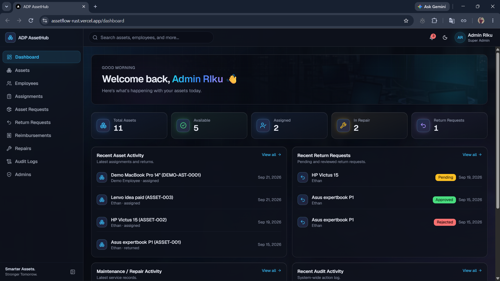
</div>

---

## ✨ Key Features

<table>
<tr>
<td width="50%"></td>
<td width="50%">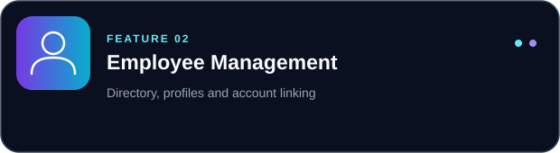</td>
</tr>
<tr>
<td width="50%"></td>
<td width="50%"></td>
</tr>
<tr>
<td width="50%">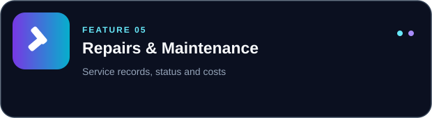</td>
<td width="50%">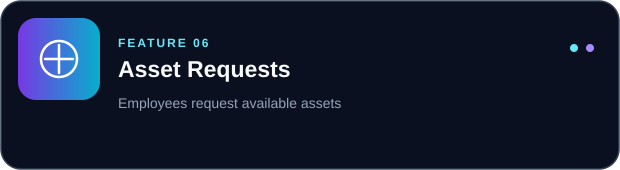</td>
</tr>
<tr>
<td width="50%">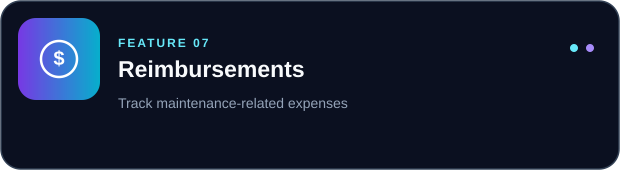</td>
<td width="50%"></td>
</tr>
</table>

---

## 👥 Role Access

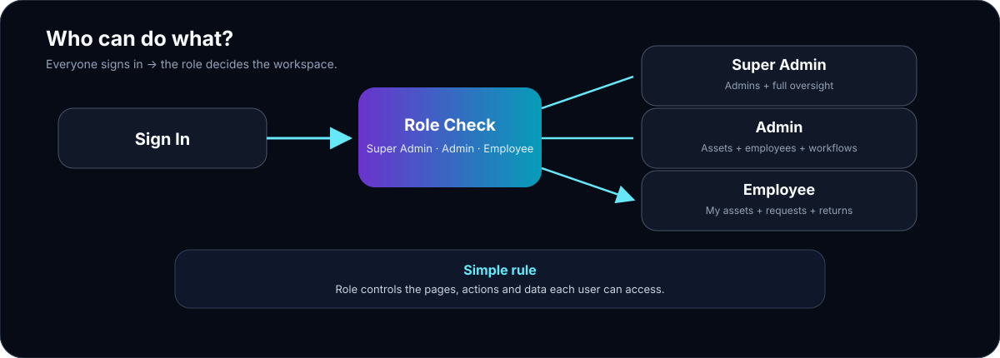

<table>
<tr><th>Role</th><th>Access</th></tr>
<tr><td><b>Super Admin</b></td><td>Full platform access + administrator account management</td></tr>
<tr><td><b>Admin</b></td><td>Assets, employees, assignments, requests, repairs, reimbursements, audit logs</td></tr>
<tr><td><b>Employee</b></td><td>Own assets, available assets, requests, returns, profile</td></tr>
</table>

> All role checks are enforced **server-side** — UI visibility is cosmetic only.

---

## 🔄 Core Workflows

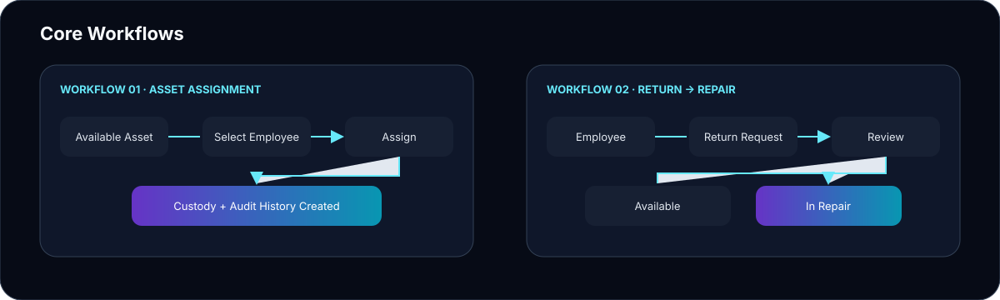

<table>
<tr>
<td width="50%">

**Asset Assignment**
1. Admin selects an available asset and an employee
2. Asset transitions to `ASSIGNED`
3. Custody record + audit log created

**Return Request**
1. Employee submits a return request
2. Admin approves → asset back to `AVAILABLE`
3. Admin redirects → asset goes `IN_REPAIR`

</td>
<td width="50%">

**Reimbursement**
1. Employee submits expense against a repair record
2. Admin reviews and approves or rejects
3. Notification sent; audit log updated

**Employee Onboarding**
1. Admin creates directory record
2. OTP email sent via Resend
3. Employee activates account and signs in

</td>
</tr>
</table>

---

## 📦 Asset Lifecycle

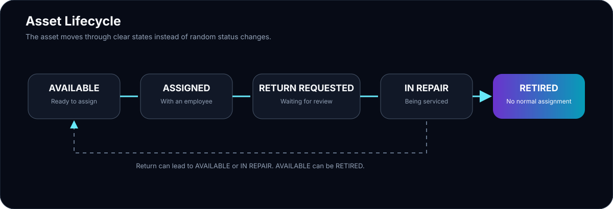

<table>
<tr>
<td width="50%">

**States**

| State | Meaning |
|---|---|
| `AVAILABLE` | Ready for assignment |
| `ASSIGNED` | With an employee |
| `RETURN_REQUESTED` | Return pending review |
| `IN_REPAIR` | Under maintenance |
| `RETIRED` | No longer active |

</td>
<td width="50%">

**Valid Transitions**

- Admin assigns → `AVAILABLE` → `ASSIGNED`
- Employee requests return → `ASSIGNED` → `RETURN_REQUESTED`
- Admin approves return → `RETURN_REQUESTED` → `AVAILABLE`
- Admin sends for repair → `IN_REPAIR`
- Repair completed → `AVAILABLE`
- Admin retires → `RETIRED`

</td>
</tr>
</table>

---

## 🧠 System Architecture

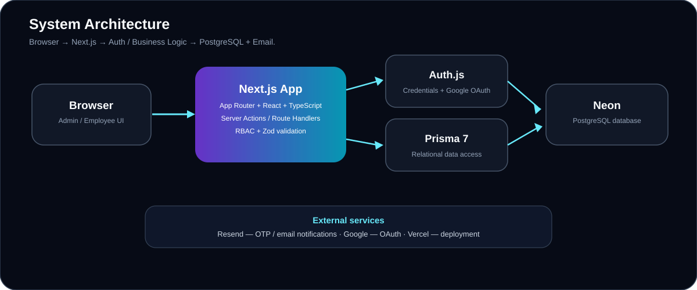

```
Browser
  └── Next.js App (Vercel)
        ├── React Server + Client Components
        ├── Server Actions — mutations validated with Zod
        ├── Auth.js v5 — JWT sessions, Credentials, Google OAuth
        ├── Prisma 7 ORM
        └── Neon PostgreSQL
              External: Resend (OTP email) · Google OAuth
```

---

## 🗃️ Database Design

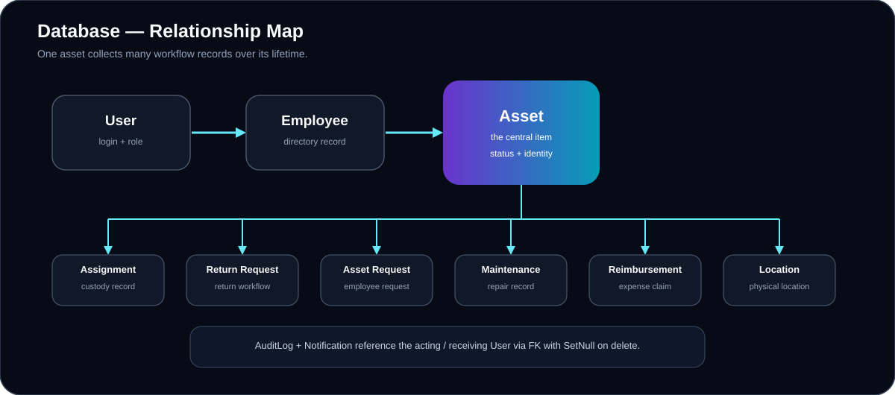

<table>
<tr>
<td width="50%">

**Core Models**

| Model | Role |
|---|---|
| `User` | Login identity + role |
| `Employee` | Company directory record |
| `Asset` | Trackable inventory item |
| `AssetAssignment` | Custody record |
| `ReturnRequest` | Return workflow |
| `AssetRequest` | Employee asset request |

</td>
<td width="50%">

**Supporting Models**

| Model | Role |
|---|---|
| `MaintenanceRecord` | Repair history |
| `Reimbursement` | Expense claim |
| `AssetLocation` | Physical location |
| `AuditLog` | Append-only event log |
| `Notification` | In-app alerts |
| `Account` / `Session` | Auth.js internals |

</td>
</tr>
</table>

**Key design decisions:**
- `User` optionally links to one `Employee` — directory records exist before sign-in
- `Asset` accumulates `Assignment`, `ReturnRequest`, `AssetRequest`, `MaintenanceRecord`, `Reimbursement`, and `AssetLocation` over its lifetime
- `AuditLog.actorId` uses `onDelete: SetNull` — audit history is preserved even when an admin is deleted

---

## 🔐 Security & Authorization

<table>
<tr>
<td width="50%">

| Mechanism | Implementation |
|---|---|
| Authentication | Auth.js v5 — JWT sessions |
| Passwords | bcrypt hashing |
| OAuth | Google — email matched to employee directory only |
| Onboarding | Hashed OTP sent via Resend |
| Route guards | `requireAuth` / `requireRole` server-side |

</td>
<td width="50%">

| Mechanism | Implementation |
|---|---|
| Mutation guards | Per-action ownership + role checks |
| Input validation | Zod on every server action |
| Audit trail | Append-only `AuditLog` table |
| Demo isolation | Server-side guards scope demo to tagged data |
| Error handling | Auth errors shown as branded messages — no traces |

</td>
</tr>
</table>

---

## 📁 Project Structure

```
.
├── prisma/
│   ├── schema.prisma          # Models, enums, relations
│   ├── seed.ts                # Dev seed — demo accounts + sample assets
│   └── migrations/            # Prisma migration history
│
├── public/
│   └── images/                # Hero background images for glass UI
│
├── scripts/
│   └── promote-super-admin.ts # CLI: promote existing admin → super admin
│
├── docs/
│   ├── screenshots/           # README screenshots
│   ├── features/              # Feature card SVGs
│   └── diagrams/              # Architecture + workflow SVGs
│
├── src/
│   ├── app/
│   │   ├── (auth)/            # Login, register, deactivated pages
│   │   ├── (dashboard)/       # All protected pages
│   │   │   ├── admins/        # Admin management — Super Admin only
│   │   │   ├── asset-requests/
│   │   │   ├── assets/        # List, detail [id], create, edit [id]/edit
│   │   │   ├── assignments/
│   │   │   ├── audit-logs/
│   │   │   ├── available-assets/
│   │   │   ├── dashboard/
│   │   │   ├── employees/
│   │   │   ├── my-assets/
│   │   │   ├── profile/
│   │   │   ├── reimbursements/
│   │   │   ├── repairs/
│   │   │   ├── return-requests/
│   │   │   └── settings/
│   │   ├── (onboarding)/      # Employee OTP onboarding flow
│   │   ├── api/auth/          # Auth.js catch-all route handler
│   │   └── demo/              # Public demo entry point
│   │
│   ├── components/
│   │   ├── design-system/     # GlassCard, FadeIn, AppBackground, PageHero, StatCard
│   │   ├── layout/            # Sidebar, Topbar, NavLinks, MobileSidebar, NotificationBell
│   │   ├── shared/            # PageHeader, EmptyState, StatusBadge, InfoGrid
│   │   ├── dashboard/         # DashboardHero, DashboardSection, ActivityRow
│   │   ├── assets/            # AssetTable, AssetForm, AssetTimeline, AssetActions
│   │   ├── employees/         # EmployeeTable, ActivateEmployeeDialog
│   │   ├── admins/            # AdminTable, InviteAdminDialog, AdminStatusButton
│   │   ├── audit-logs/        # AuditLogTable, AuditLogFilters, Pagination
│   │   ├── reimbursements/    # Submit / Approve / Reject / Cancel + table
│   │   └── settings/          # ThemeSettings, ChangePasswordForm
│   │
│   ├── lib/
│   │   ├── actions/           # Server actions — one file per domain (mutations)
│   │   ├── data/              # Server data-fetching — one file per domain (reads)
│   │   ├── validations/       # Zod schemas — one file per domain
│   │   ├── auth-guards.ts     # requireAuth / requireRole — authorization boundary
│   │   ├── audit.ts           # recordAuditLog helper
│   │   ├── notifications.ts   # createNotification / createNotifications
│   │   ├── demo.ts            # Demo-mode isolation guards
│   │   ├── email.ts           # Resend email helpers
│   │   ├── otp.ts             # OTP generation / verification
│   │   ├── password.ts        # bcrypt helpers
│   │   └── prisma.ts          # Prisma singleton
│   │
│   ├── config/
│   │   ├── nav.ts             # Navigation items keyed by role
│   │   └── route-access.ts    # Route → required role mapping
│   │
│   ├── types/                 # TypeScript declarations
│   ├── auth.ts                # NextAuth instance (Node.js — full features)
│   ├── auth.config.ts         # NextAuth config (edge-safe — middleware)
│   └── proxy.ts               # Edge middleware route gate
│
├── auth.config.ts             # Root auth config base
└── .env.example               # Environment variable reference
```

---

## 🎥 Product Demo

**Watch the full ADP AssetHub product walkthrough**

> The demo video covers the complete admin and employee experience including authentication, asset management, assignments, return requests, repairs, reimbursements, audit logs, and admin controls.

```
docs/demo/adp-assethub-demo.mp4
```

> _Place the recorded demo at the path above. For GitHub README compatibility, host it on YouTube, Loom, or as a GitHub Release asset and update this section with the public link._

---

## 🖥️ Screenshots

### 🔐 Authentication

<table>
<tr>
<td align="center">
<sub><b>🔑 Login</b></sub><br>
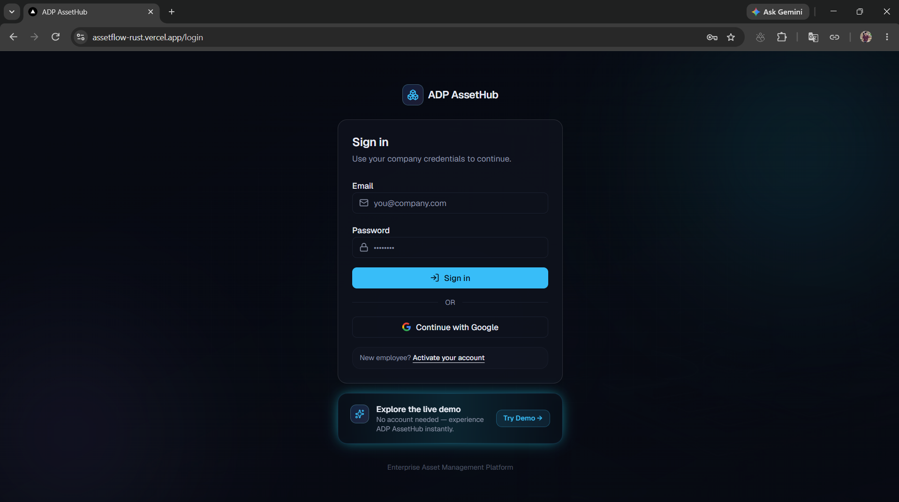
</td>
</tr>
</table>

### 📊 Admin Experience

<table>
<tr>
<td align="center" width="50%">
<sub><b>📦 Assets</b></sub><br>
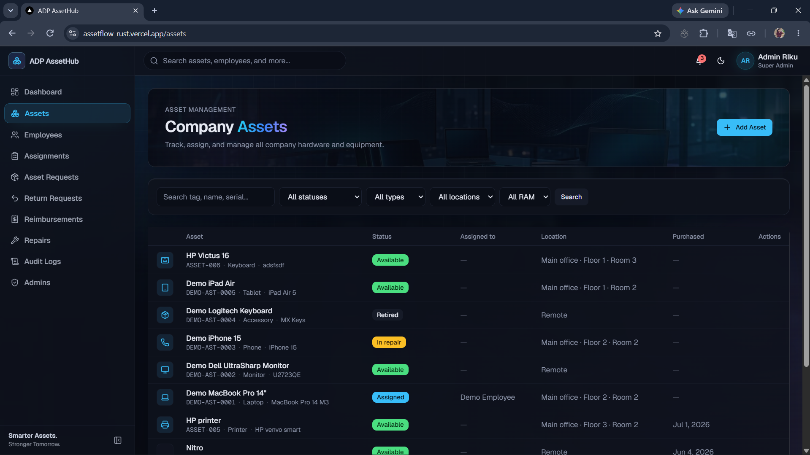
</td>
<td align="center" width="50%">
<sub><b>📄 Asset Details</b></sub><br>
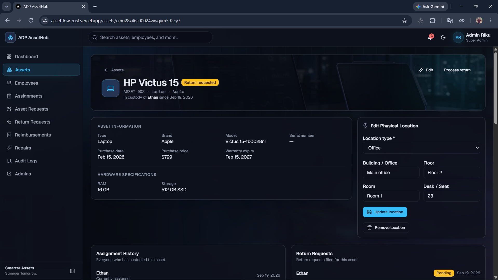
</td>
</tr>
<tr>
<td align="center" width="50%">
<sub><b>👥 Employees</b></sub><br>
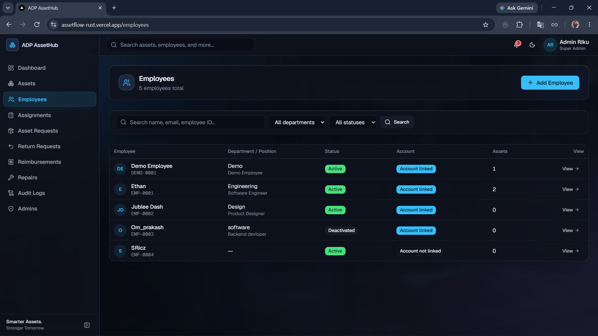
</td>
<td align="center" width="50%">
<sub><b>🔄 Assignments</b></sub><br>
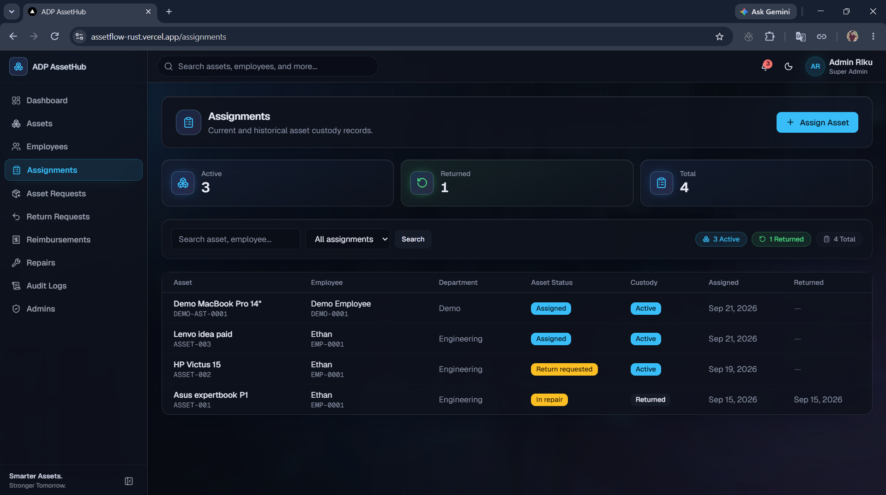
</td>
</tr>
</table>

### 🔄 Business Workflows

<table>
<tr>
<td align="center" width="50%">
<sub><b>📨 Asset Requests</b></sub><br>
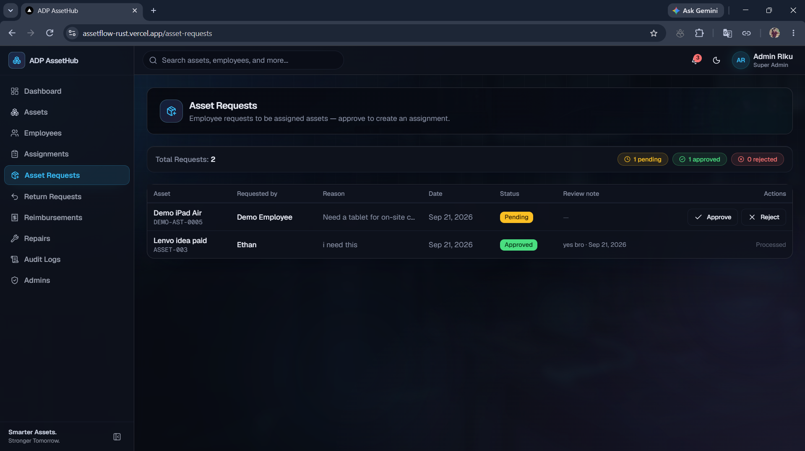
</td>
<td align="center" width="50%">
<sub><b>↩️ Return Requests</b></sub><br>
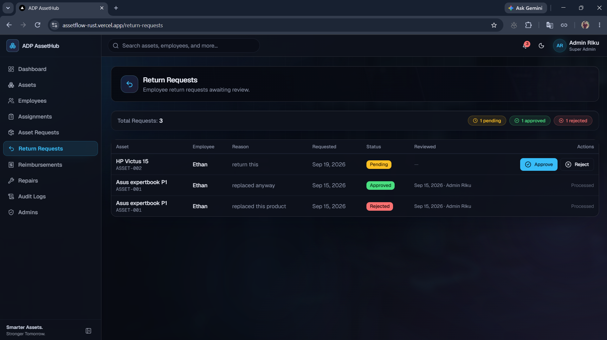
</td>
</tr>
<tr>
<td align="center" width="50%">
<sub><b>🔧 Repairs</b></sub><br>
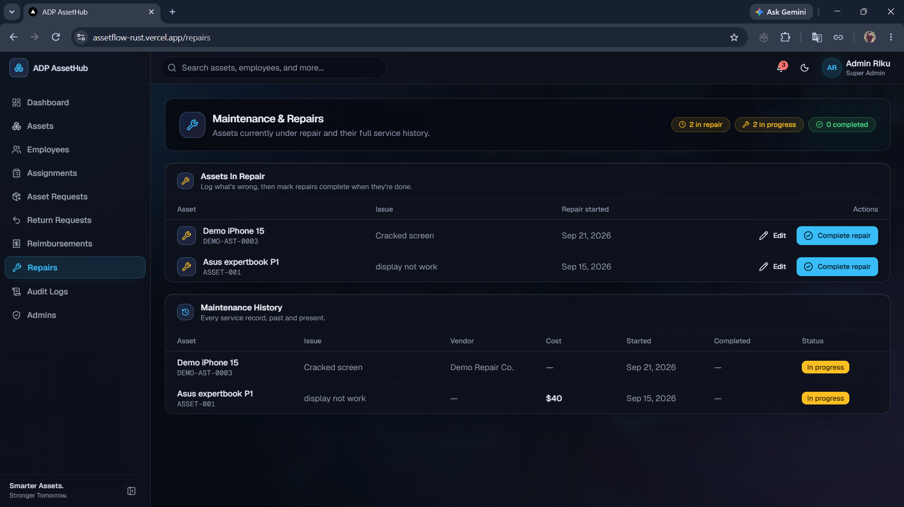
</td>
<td align="center" width="50%">
<sub><b>💰 Reimbursements</b></sub><br>
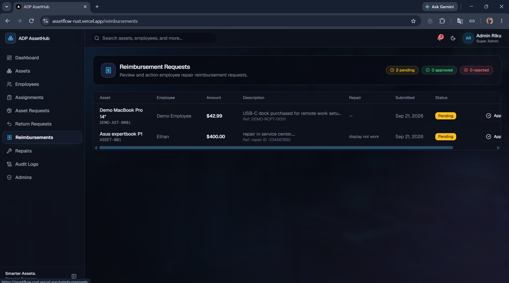
</td>
</tr>
</table>

### 🛡️ Administration & Security

<table>
<tr>
<td align="center" width="50%">
<sub><b>📜 Audit Logs</b></sub><br>
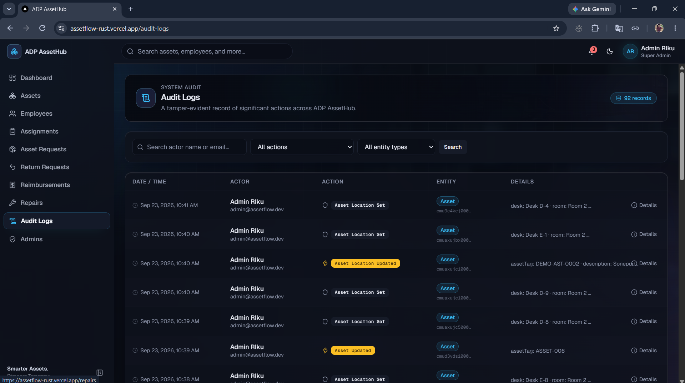
</td>
<td align="center" width="50%">
<sub><b>👑 Admins</b></sub><br>
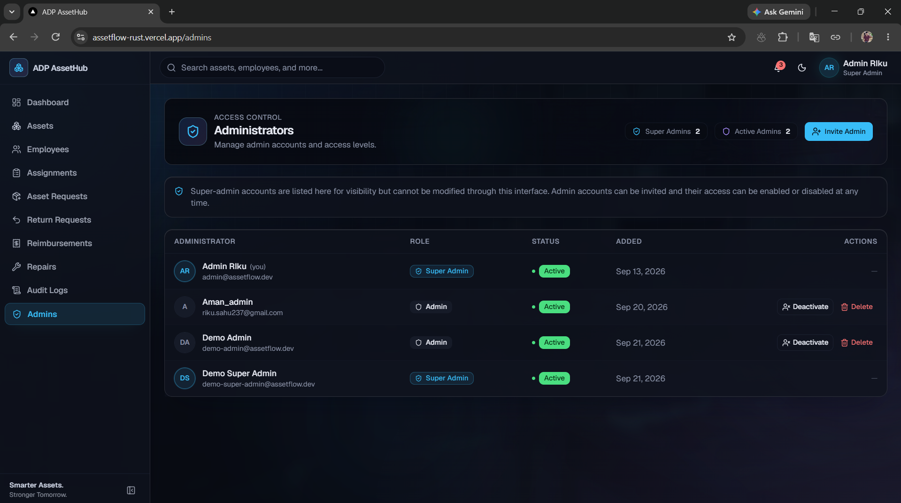
</td>
</tr>
</table>

### 👤 Employee Experience

<table>
<tr>
<td align="center" width="50%">
<sub><b>🏠 Employee Dashboard</b></sub><br>
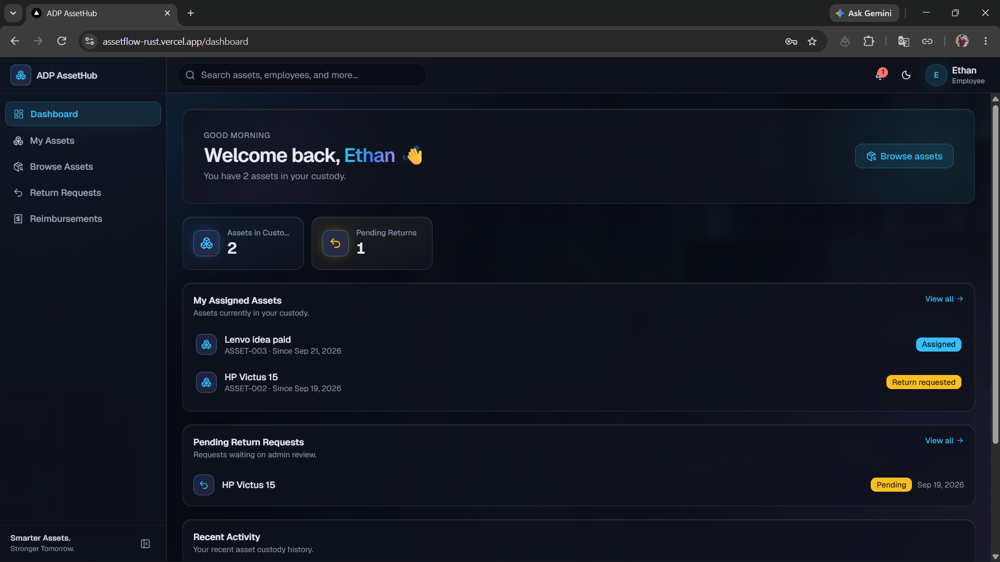
</td>
<td align="center" width="50%">
<sub><b>💻 My Assets</b></sub><br>
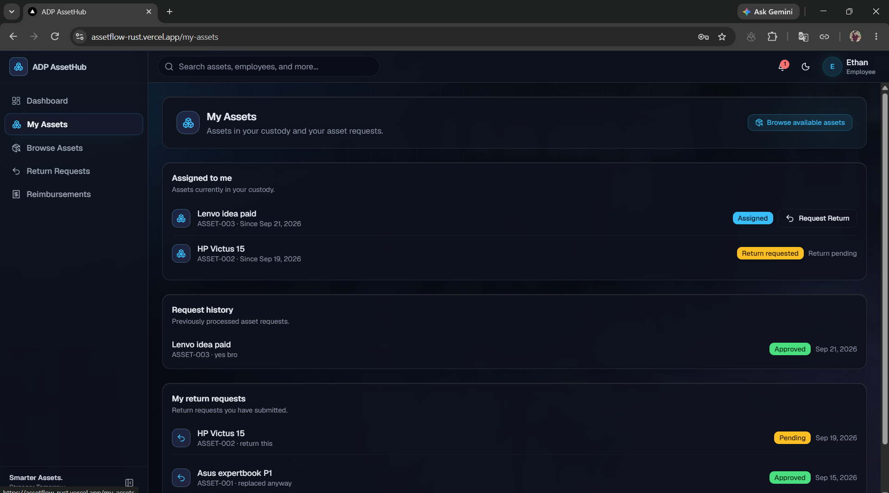
</td>
</tr>
<tr>
<td align="center" width="50%">
<sub><b>👤 Profile</b></sub><br>
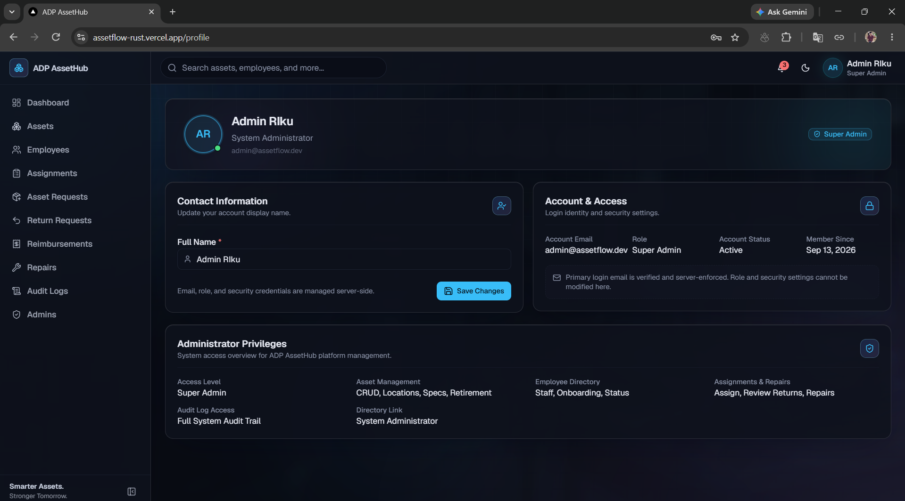
</td>
<td align="center" width="50%">
<sub><b>⚙️ Settings</b></sub><br>
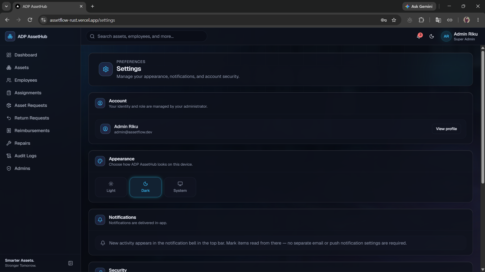
</td>
</tr>
</table>

---

## ⚙️ Tech Stack

<table>
<tr>
<td><b>Framework</b></td><td>Next.js 16 (App Router)</td>
<td><b>Language</b></td><td>TypeScript 5</td>
</tr>
<tr>
<td><b>UI</b></td><td>React 19 + Tailwind CSS 4</td>
<td><b>Validation</b></td><td>Zod</td>
</tr>
<tr>
<td><b>Database</b></td><td>PostgreSQL (Neon)</td>
<td><b>ORM</b></td><td>Prisma 7</td>
</tr>
<tr>
<td><b>Authentication</b></td><td>Auth.js v5</td>
<td><b>OAuth</b></td><td>Google</td>
</tr>
<tr>
<td><b>Email</b></td><td>Resend</td>
<td><b>Icons</b></td><td>Lucide React</td>
</tr>
<tr>
<td><b>Deployment</b></td><td>Vercel</td>
<td><b>DB Hosting</b></td><td>Neon</td>
</tr>
</table>

---

## 🚀 Local Development

```bash
# 1. Clone
git clone https://github.com/ItsRiku237/AssetFlow.git && cd AssetFlow

# 2. Install (runs prisma generate automatically via postinstall)
npm install

# 3. Environment
cp .env.example .env
# Fill in values — see Environment Variables below

# 4. Migrate database
npx prisma migrate deploy

# 5. Seed (optional — creates demo accounts and sample assets)
npx tsx prisma/seed.ts

# 6. Dev server
npm run dev
```

**Other scripts:**

```bash
npm run build                    # Production build
npm run lint                     # ESLint check
npm run promote:superadmin       # CLI: promote a user to SUPER_ADMIN
```

---

## 🔑 Environment Variables

| Variable | Purpose | Required |
|---|---|---|
| `DATABASE_URL` | PostgreSQL connection string (Neon) | ✅ |
| `AUTH_SECRET` | Auth.js session encryption secret | ✅ |
| `AUTH_URL` | App base URL for OAuth callbacks | ✅ |
| `AUTH_GOOGLE_ID` | Google OAuth client ID | ✅ |
| `AUTH_GOOGLE_SECRET` | Google OAuth client secret | ✅ |
| `RESEND_API_KEY` | Resend API key for OTP emails | ✅ |
| `RESEND_FROM` | Sender address for OTP emails | ✅ |
| `DEMO_ADMIN_PASSWORD` | Password for seeded demo admin | Optional |
| `DEMO_EMPLOYEE_PASSWORD` | Password for seeded demo employee | Optional |
| `DEMO_SUPER_ADMIN_PASSWORD` | Password for seeded demo super admin | Optional |

See `.env.example` for placeholder formatting. **Never commit real secrets.**

---

## 🎮 Demo Mode

The `/demo` page lets anyone try all three roles without an account. Demo sessions are isolated server-side — a demo session cannot read or mutate real, non-demo-tagged records regardless of the role it holds.

---

## 💡 Engineering Highlights

<table>
<tr>
<td width="50%">

- 🔐 **Server-side RBAC** — every page and action checks role on the server
- 🔄 **Asset State Machine** — deterministic transitions prevent invalid states
- 📋 **Custody History** — assignment records are never overwritten; full history preserved
- 🛡️ **Append-only Audit Log** — `AuditLog.actorId` uses `SetNull` on delete to preserve history

</td>
<td width="50%">

- 👤 **Decoupled Directory** — `Employee` records exist independently of login accounts
- 📨 **OTP Onboarding** — secure activation links the login identity to the directory record
- 🎨 **Shared Design System** — glassmorphism component library keeps UI consistent
- 📱 **Fully Responsive** — admin and employee UIs adapt across desktop, tablet and mobile

</td>
</tr>
</table>

---

## 📈 Future Improvements

- End-to-end and integration test coverage
- Bulk asset import and export
- Configurable notification preferences per user
- Analytics and reporting dashboards
- Multi-tenant organisation support
